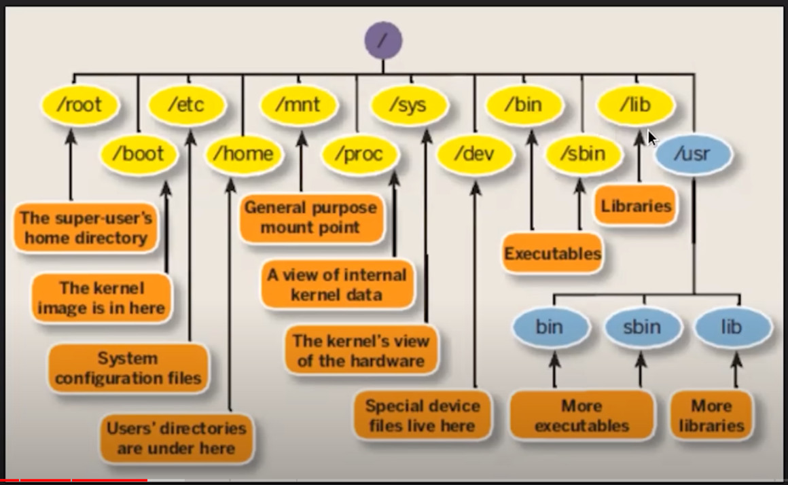

# Linux

###### linux file system
{align=right}

###### Change IP Address in RHEL 9 

```bash
#list all IPs, show details of NIC
ip -c a
nmcli device show eth1
```
```bash
#modify NIC with the new IP, then restart the network
nmcli con modify eth1 ipv4.addresses 172.16.1.3/16
nmcli con up eth1
```
###### Network config files in RHEL

```bash
#Network files location, details
ls /etc/NetworkManager/system-connections
cat ethX.nmconnection
```

###### grep
Command-line utility for searching plain-text data sets for lines that match a regular expression. 

###### Hostname 

```bash
hostnamectl set-hostname newhostname
```

###### Mount 
Before a user can access a file on a Unix-like machine, the file system on the device which contains the file needs to be mounted with the mount command. Frequently mount is used for SD card, USB storage, DVD and other removable storage devices. 

```bash
# List mount-points
findmnt (optional)<device/directory>
# mounting the share
mkdir ~/temp
sudo mount <source_machine>:<PATH_To_Share> ./temp/
```

```bash
# Unmount
umount <device/directory>
umount temp/
```
