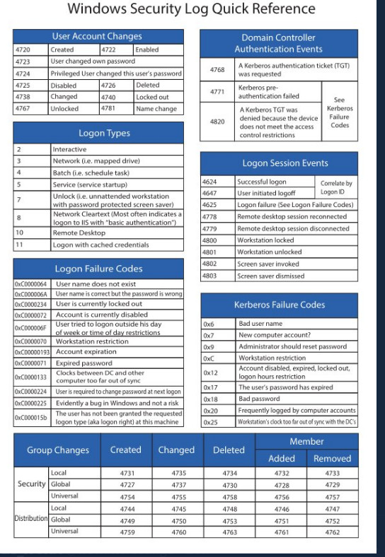

# PowerShell 
PowerShell is a task automation and configuration management program from Microsoft, consisting of a command-line shell and the associated scripting language.

###### Install PowerShell
PowerShell was made open-source and cross-platform with PowerShell Core, and can be installed on multiple operating systems.

###### Windows
1. Download MSI Package from the [Official PowerShell Docs](https://docs.microsoft.com/en-us/powershell/scripting/install/installing-powershell-on-windows?view=powershell-7.2)
2. Set up PowerShell Profile in Windows Terminal ([[windows-terminal]]).
```json
"commandline": "pwsh.exe -nologo",
"name": "Powershell",
"source": "Windows.Terminal.PowershellCore"
```

###### Linux (Ubuntu)
```bash
# Update the list of packages
    sudo apt-get update
# Install pre-requisite packages.
    sudo apt-get install -y wget apt-transport-https software-properties-common
# Download the Microsoft repository GPG keys
    wget -q https://packages.microsoft.com/config/ubuntu/20.04/packages-microsoft-prod.deb
# Register the Microsoft repository GPG keys
    sudo dpkg -i packages-microsoft-prod.deb
# Update the list of packages after we added packages.microsoft.com
    sudo apt-get update
# Install PowerShell
    sudo apt-get install -y powershell
# Start PowerShell
    pwsh
```

###### Profile

```powershell
#set up a PowerShell Profile by opening the profile script
code $PROFILE
```

###### (Optional) Set up starship Prompt
You can customise the look and feel of PowerShell with the Starship Prompt ([[starship]]).

###### Run PowerShell script under python
```python
## use powershell script in Python
import subprocess

def run_powershell_script(script_path):
    completed_process = subprocess.run(["powershell", "-File", script_path], capture_output=True)
    return completed_process

##using the decode method to decode the returned message
str = "this is string example....wow!!!";
str = str.encode('utf-8', 'strict');
print ("Encoded String: ", str)
str = str.decode('utf-8', 'strict')
print ("Decoded String: ", str)
```


#### PowerShell hashtable
https://learn.microsoft.com/en-us/powershell/scripting/learn/deep-dives/everything-about-arrays?view=powershell-5.1


See my [About](about.md) page for details.

At the same time you could see [certificate](certificate.md)

<!-- images/linux-file-system.jpg -->
<!--  -->
<!--  -->
<!--  -->
{align=midlle}
